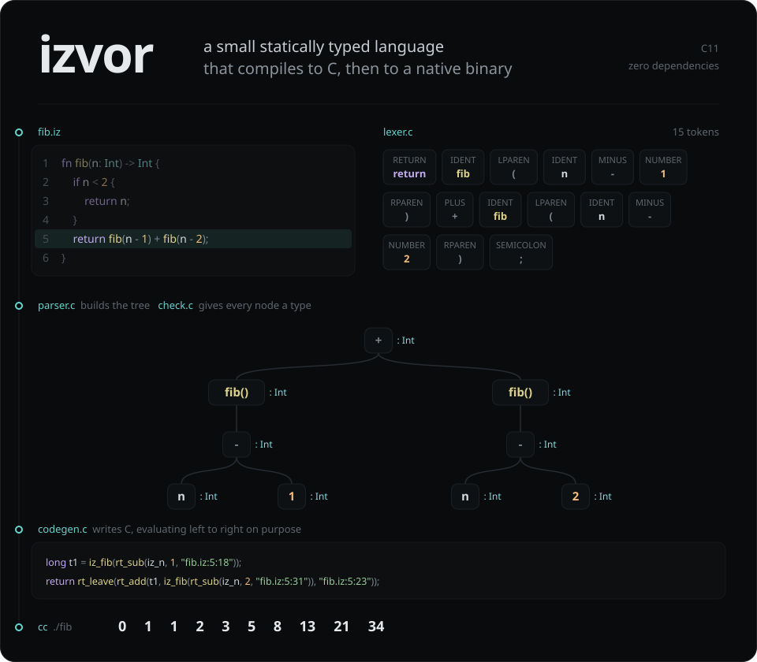
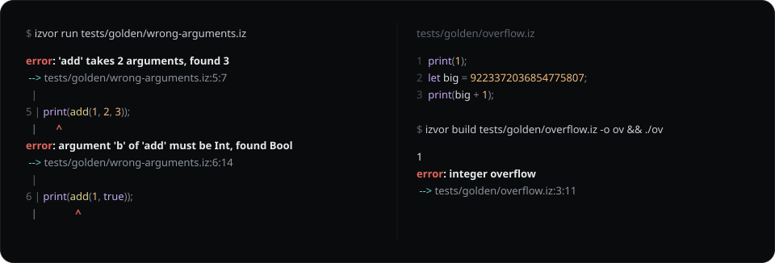
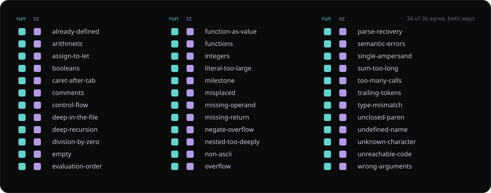
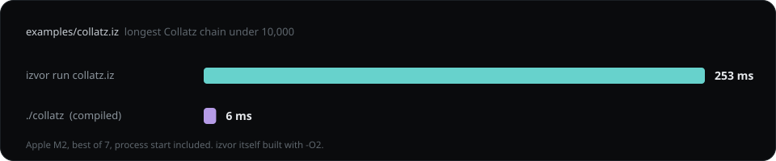

<p align="center">
  
</p>

<p align="center">
  <a href="https://github.com/levimackay/izvor/actions/workflows/ci.yml"></a>
  
  
  
  
</p>

**izvor** is a small statically typed programming language and the compiler
for it, written in C11 with nothing underneath but a C compiler. It reads a
program, gives every expression a type, and then either runs it on the spot
or writes it out as C and hands that to `cc` for a native binary.

*Izvor* is Serbian and Croatian for a spring, the place a river starts.
Source files end in `.iz`.

```sh
git clone https://github.com/levimackay/izvor && cd izvor && make
./build/izvor build examples/fib.iz && ./examples/fib
```

## The language, and what it turns into

<table>
<tr>
<th align="left"><code>examples/fib.iz</code></th>
<th align="left"><code>izvor emit fib.iz</code>, trimmed to the program</th>
</tr>
<tr>
<td valign="top">

```rust
fn fib(n: Int) -> Int {
    if n < 2 {
        return n;
    }
    return fib(n - 1) + fib(n - 2);
}

var i = 0;
while i < 10 {
    print(fib(i));
    i = i + 1;
}
```

</td>
<td valign="top">

```c
static long iz_fib(long iz_n) {
    rt_enter("fib.iz:1:4");
    if (iz_n < 2) {
        return rt_leave(iz_n);
    }
    long t1 = iz_fib(rt_sub(iz_n, 1, "fib.iz:5:18"));
    return rt_leave(rt_add(t1, iz_fib(rt_sub(iz_n, 2, "fib.iz:5:31")), "fib.iz:5:23"));
}

int main(void) {
    long iz_i = 0;
    while (iz_i < 10) {
        rt_print_int(iz_fib(iz_i));
        iz_i = rt_add(iz_i, 1, "fib.iz:11:11");
    }
    return 0;
}
```

</td>
</tr>
</table>

A few things in that C are there on purpose. Every `+` and `-` goes through a
checked helper, because overflow in izvor stops the program and says where
instead of quietly wrapping. `t1` exists because C doesn't promise which side
of a `+` runs first and izvor does: left, always. And `rt_enter` counts calls,
so runaway recursion ends with an error message rather than a segfault.

| What it has today | |
|---|---|
| **Types** | `Int` (64-bit, signed) and `Bool`, inferred or written out: `let age: Int = 22;` |
| **Bindings** | `let` never changes, `var` can. No shadowing, so a name always means one thing. |
| **Functions** | Typed parameters, optional return type, recursion, callable before they're declared |
| **Control flow** | `if` / `else if` / `else`, `while`, `return` |
| **Operators** | `+ - * / %`, comparisons, `== !=`, and `&& \|\| !` with short-circuiting |
| **Everything else** | `print(value);`, `//` comments, semicolons after every statement |

## It tells you exactly where

<p align="center">
  
</p>

Every stage reports through one module, so an error from the lexer looks
exactly like one from the type checker. The parser recovers after a mistake
and keeps reading, and the checker never stops at the first problem, so one
run shows you everything wrong with a file. Runtime errors carry the line and
column of the operator that failed, whether the program was interpreted or
compiled.

## Two back ends, one answer

<p align="center">
  
</p>

Every program in [`tests/golden`](tests/golden) has its exact output checked
in next to it, errors included. `make test` runs each one through the
interpreter, then compiles it, runs the binary, and requires both to match
that file byte for byte. The interpreter and the code generator share nothing
but the syntax tree, so a bug would have to happen the same way twice to get
past.

Around that:

- a fuzzer pushes 20,000 random programs through the lexer, parser, checker
  and code generator and only asks that nothing crashes
- everything is built with UndefinedBehaviorSanitizer, so a stray read or a
  signed overflow in the compiler itself is a loud failure
- CI runs all of it on Linux and macOS, and again under AddressSanitizer and
  LeakSanitizer

## Fast when it's compiled

<p align="center">
  
</p>

Same program, same answer. The compiled one is about forty times faster, and
most of what's left is the operating system starting the process.

## How it's put together

```
source ─▶ lexer ─▶ parser ─▶ checker ─┬─▶ interpreter             izvor run
                                      └─▶ codegen ─▶ cc ─▶ binary  izvor build
```

| Stage | File | Lines | What it does |
|---|---|---:|---|
| Lexer | [`lexer.c`](src/lexer.c) | 286 | Characters to tokens. One character of lookahead, never backtracks. |
| Parser | [`parser.c`](src/parser.c) | 576 | Recursive descent, one function per precedence level, recovers after errors. |
| Tree | [`ast.c`](src/ast.c) | 335 | Tagged unions for expressions and statements, and freeing all of it. |
| Checker | [`check.c`](src/check.c) | 386 | Names, types, returns, arity, dead code. Reports everything it finds. |
| Interpreter | [`interp.c`](src/interp.c) | 251 | Walks the checked tree. The reference the compiled output has to match. |
| Code generator | [`codegen.c`](src/codegen.c) | 488 | Writes readable C and pins down evaluation order. |
| Diagnostics | [`diag.c`](src/diag.c) | 144 | The single definition of what an error looks like. |
| Driver | [`main.c`](src/main.c) | 265 | `run`, `build`, `emit`, `-e`, and piping C into `cc`. |

Line counts include each module's header.

## Decisions worth defending

- **The tree is a tagged union, and no `switch` over a node's kind has a
  `default`.** Adding a node kind makes the compiler list every place that
  forgot to handle it.
- **Tokens borrow the source.** Nothing is copied, and every error can point
  back into the original text.
- **Overflow and division by zero are errors, not undefined behavior.** C
  leaves both open. izvor decides, and both back ends decide the same way.
- **Left to right, always.** gcc and clang don't agree on argument order, so
  the generated C doesn't give them a choice.
- **No shadowing.** It catches a class of mistakes, and it means every izvor
  name maps straight onto a C name with no renaming.
- **Semicolons.** Without them, a statement that's just an expression gets
  two readings across a line break.

The reasoning, the trade-offs, and the limits that are measured rather than
guessed are in [docs/ARCHITECTURE.md](docs/ARCHITECTURE.md).

## Try it

```sh
make                                   # build the compiler
make test                              # 36 programs, interpreted and compiled
./build/izvor run examples/collatz.iz  # interpret
./build/izvor build examples/fib.iz    # native binary at examples/fib
./build/izvor emit examples/fib.iz     # read the C it writes
./build/izvor -e "2 + 3 * 4"           # one expression, with its parse tree
```

`build` uses `cc`, or whatever `CC` points at.

## What's next

Arrays, structs and strings, with the small runtime they need. After that,
`parallel` blocks where sharing mutable state is a compile error instead of a
race. The plan is in [docs/ROADMAP.md](docs/ROADMAP.md).

## The IDE

<a href="https://github.com/levimackay/izvor-studio"></a>

There's a design prototype of an IDE for izvor,
[Izvor Studio](https://github.com/levimackay/izvor-studio). It was designed
with Claude Design, and it shows where the tooling could go rather than
anything that exists yet.

## Layout

```
src/        the compiler
examples/   programs to try
tests/      unit tests, golden programs, and the fuzzer
docs/       architecture, roadmap, and the images in this file
```

MIT licensed, see [LICENSE](LICENSE).
